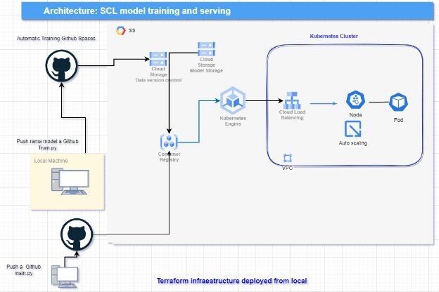
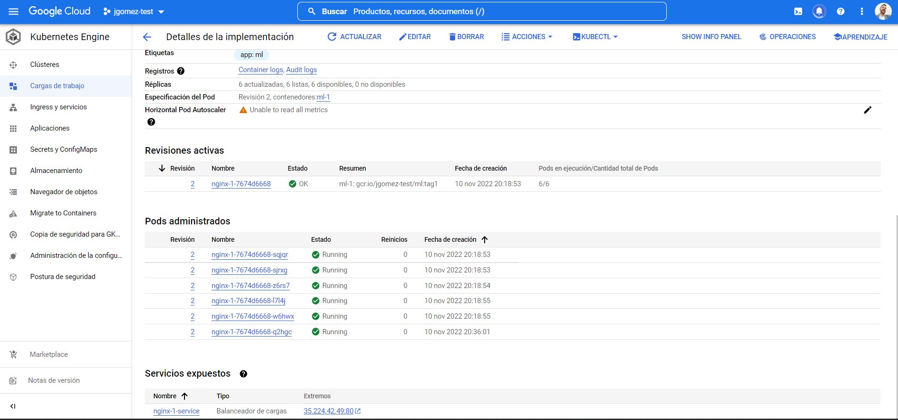

# Arquitectura desafío

## _Introducción_

Para este desafío se ha diseñado una arquitectura enfocada a proveer un modelo de machine learning como servicio, a través de una API REST, esta arquitectura contempla diferentes fases expuestas de la siguiente imagen:

**Data versión control:**

Como buenas prácticas, en Machine Learning no solo se trata de versionar el código, también los datos son por esto que con la ayuda de DVC, se puede tener en un repositorio externo diferentes versiones de los dataset de entrenamiento de los modelos, desde los datos naturales hasta el feature engenieering. Adicionalmente esto facilita a la hora de reproducción en otros ambientes, ya que los datos se guardan en un repositorio externo y no se comparten atravez de git.

* Herramientas utilizadas: [DVC](https://dvc.org/), Google Storage

**CT (Continuos Training)**

Con el fin de tener un proceso automatizado, el entrenamiento del modelo sobre el archivo train.py, se realiza sobre los espacios de Github, este proceso responde a buenas practicas de versionado de código donde el trigger del entrenamiento es un push a la rama “Model”, esto usando Github Actions y CML.

En este caso en particular no hay necesidad de utilizar más recursos para el entramiento, pero de ser necesario el mismo proceso se le puede agregar una capa para entrenarse en GCP usando computo más pesado.

* Herramientas utilizadas: [Github Actions](https://github.com/features/actions), [CML](https://cml.dev/)

**Experiment Tracking**

Con la ayuda de la herramienta CML, cada vez que se realiza un entrenamiento, los resultados de las métricas son publicamos como un commit, así se pueden tener todas las métricas sobre los entramientos y poder entender el impacto del model tunning directamente en GitHub.

**Model Registory**

Como parte de tener un pipeline para todo el proceso de entrenamiento y despliegue también se hace necesario usar un versionamiento de los modelos, aquí se hace uso de DVC de nuevo para guardar todos los modelos en Google storage y así tener un control de su referencia.

* Herramientas utilizadas: DVC, Google Storage.

**Model deployment**

Esta fase de deployment del modelo se encuentra automatiza con la ayuda de Github Actions, que activa el trigger en GPC para aplicar los cambios en el Cluster de Kubernetes que aloja la API, aun que este proceso es automático, no se encuentra directamente conectado al continuos training, ya que primero se experimentan con una series de cambio en los hyper parámetros de los modelos y cuando se tienen el resultado con buenas métricas, se revisa su versión y se actualiza el código de la API en la rama “api”, que lanza el despliegue con la versión correspondiente.

* Herramientas utilizadas: [Fastapi](https://fastapi.tiangolo.com/), Kubernetes,DVC, Github, Github Actions, [GPC Container registry](https://cloud.google.com/container-registry).

**Model Monitoring**

Como parte del ciclo de un modelo de ML, una parte primordial es su monitoreo, en el cual se comparan los datos de entrada y las predicciones sobre el tiempo, para esta implementación se utilizo Aporia, un servicio online con actualización en tiempo real que nos mostraba las distribuciones de las entradas y salidas del modelo.

Este monitoreo se hace a través de Fastapi y la Api propia de aporía para realizar la configuración.

* Herramientas utilizadas: [Aporia](https://www.aporia.com/)

**Infraestructura como código**

Para la automatización y la creación de la infraestructura en GCP, se ha utilizado Terraform para la creación de los Bucket y el clúster de Kubernetes con sus respectivas configuraciones de VCP y subneting.

* Herramientas utilizadas: [Terraform](https://www.terraform.io/)

## Distribución de carpetas-ramas

*Model -carpeta-rama*

En la carpeta model de la rama main, se cuenta todo el código de Python para entrenar el modelo.

En la rama Model, se encuentra la automatización del modelo con los workflows de CML y GitHub Actions.

*API – rama- carpeta*

Carpeta con la api de Fastapi, archivos de Docker y requirements .

Rama api: api con GitHub actions, con  yaml para despliegue continuo en Kubernetes.

*Carpeta Tf-infraestrucura*

Archivos de Terraform para creación de infraestructura en GCP, Kubenetes y Storage.

*Carpeta Fake-data*

Archivo dataset-fake.py, con el código de data-aumentation, con distribución normal al dataset *original,reporte html de nuevo dataset para hacer pruebas de monitoreo.*

*Carpeta Api-v2*

Código de la api con adicional para hacer el monitoreo con Aporia y archivo, test,py que selecciona los datos del dataset fake y realiza el post a la API.

*Carpeta Test-apiv2*

Codigo del codigo que testea la API online para los 45s de exposición, reporte de resultados archivo Html

## DESAFIO

1. Exponer el modelo serializado a través API REST.

R// Se ha realizado un despliegue en una arquitectura de Kubernetes, el cluster creado se puede ver en la siguente imagen.

**Cluster en Kubernetes GCP, Puerto expuesto API:**

Estar arquitectura fue selecionada para tener una alta disponibilidad y seguridad de la API, tambien ideal para hacer despliegues tipo A/B Testing en momentos donde se requiera evaluar 2 o mas modelos o hacer despliegues tipo Canary ideales para dar entrada en produccion a un nuevo modelo, controlando el trafico desde el balanceador de carga, ademas de poder hacer implementaciones de la API de monitoreo del modelo (Explicado en el ultimo punto) con una carga mas baja de trafico que permita sensar almenos un 10% de los datos.
Basado en la prueba de estrés a la API tambien se tomo la desicion de una arquitectura en Kubernetes, ya que al usar otra como lo puede ser CloudRun, estos presentan ColdStart que podría relentelizar las respuestas de request a la API. Sin embargo depenpiendo de las necesidades de la API y tambienn de su monitoreo se pueden llegar a tomar las decisiones de acuerdo a su demanda y necesidad.

2. Automatizar el proceso de construcción y despliegue de la API, utilizando uno o varios servicios cloud.

R// proceso realizado con Gitgug Actions - Container Registry – Kubernetes, ademas se incluyo un CT (Continuos training) el cual entrena el modelo automaticamente despues de hacer un push a la rama model y publica sus resultados para tener un tracking me las metricas.

3. Hacer pruebas de estrés a la API con el modelo expuesto con al menos 50.000 requests durante 45 segundos. Para esto debes utilizar esta herramienta y presentar las métricas obtenidas.

R// para las pruebas se decidió cambiar la herramienta de testeo y utilizar Locust , ya que es una herramienta para testear APIs siguiendo lenguaje Python que ayudaría a tomar los datos el Csv de fake data y que las pruebas no solo sean enfocadas a numeros de request si no a respuesta de diferentes datos sobre el modelo.

Ver resultados en archivo repor\_lr, fue testeado con el modelo Logostic regresion     
[Ver reporte HTML](https://drive.google.com/file/d/150sJ4Q2mWoZGSYM_FYOhJ0mpiOpg3LXb/view?usp=sharing).

como podria mejorar aun mas la API?, despues de un monitoreo y ver la latencia entre los servicios , podrian realizarce configuraciones sobre el balanceador de carga y sistemas de auto escalado mas agresivos, ya que lo ideal es trabajar con el numero de pods minimo. Adicionalmente el tiempo de respuesta del modelo se puede mejorar usando tenicas de quantización con Onnix https://onnxruntime.ai/ esto permite tener inferencias mas rapidas y modelos mas pequeños. Tambien puede ayudar a utilizar modelos mas complejos o de Deep Learning, manteniendo una inferencia acorde a la necesidad de la respuesta.

4. El proceso de creación de infraestructura debe ser realizado con Terraform.

R// Creación de Clúster de Kubernetes con VPC, además de Storage para el versionamiento de datos y modelos.
   [Terraform code](https://github.com/Camilogc93/fastapi-ml/tree/main2/Tf-infraestructura/Cluster).
   
   Ver imagen del punto 1, numero de pods y servicio expuesto.

5. ¿Cuáles serían los mecanismos ideales para que sólo sistemas autorizados puedan acceder a esta API? (NO es necesario implementarlo). a. ¿Este mecanismo agrega algún nivel de latencia al consumidor? ¿Por qué?

Para este casi se exponen 2 casos que pueden ir tanto independientes como trabajando en conjunto.

` `Caso 1: que el servicio que llame la API REST, se encuentre en la misma VCP y que el balanceador de carga de Cluster de Kubernetes solo responda a peticiones especiales de ciertas ips

`	`Caso 2: en la API rest se puede adicionar un token de autenticación para poder ser consumida.

Los dos casos se pueden complementar para tener mayor seguridad, ahora bien, puede que aumente la latencia de la API si primero tiene que pasar por una autenticación, cuando el clúster, solo reciba peticiones de un servicio externo, este servidor al igual que el clúster debería tener un sistema de auto escalado.

Normalmente el caso 1 brinda una seguridad suficiente para un modelo de ML, ya que esta rara vez se exponen directamente a un usuario y van acompañados de otras fases de procesamiento de datos que ejecutan un pipeline de transformación, así pueden entregan los datos como el modelo se entrenó y el sistema completo es un conjunto de micro servicios que van pasando el dato de fase en fase.

6. ¿Cuáles serían los SLIs y SLOs que definirías y por qué?

Para este caso hay 2 casos muy diferentes con métricas muy distintas a la hora de exponer un modelo de ML como servicio, por un lado está la arquitectura vista como microservicios donde lo que importa es que el sistema responda, se escale, este dispone cuando tenga alta demanda para poder cumplir con el objetivo del microservicio, por otro lado esta el punto de vista del modelo, como Mlops es importante monitorear el Concept drift y Data drift , conceptos sobre el cambio en las distribuciones de los datos de entrada y de salida, que afectan la calidad de predicción del modelo, lo que desencadena un entrenamiento continuo del modelo según los datos varíen sobre el tiempo.

Caso SRE  

Los Sli's y Slo's, parte desde una necesidad de servio que de sea prestar, por esto es imporante definie un contexto en el cual la API debería funcionar para tener claras las metricas de evaluación.

Supongamos que lo mas importnate es la disponibilidad y que la API deba estar por percentil de 95 minimamente, esto hace que sea necesario monitorear los pods de kubernetes que se lancen correctamente en caso de presentar un error, o se escalen a la demanda de trafico para no dejar de responder.

Como métricas de un servicio lo mas importante es medir la disponibilidad de la API, cantidad de llamadas realizadas/ errores, el tiempo de respuesta y tanto el uptime como downtime a la hora de escalar.
La disponibilidad de la API es una métrica básica que nos realmente cuanto tiempo estuvo disponible cuando se necesito el servicio. Esto acompañado de los errores detectados número de request/fallidos.

Para tener un mínimo de pods y no incurrir en gastos innecesarios es bueno tener estadísticas según el numero de request, la política de auto escalado cuanto tarda en crear nuevos pods y estos cuando se dejan de utilizar en cuanto se destruyen.
Las definición de métricas normalmente se hace teniendo en cuenta las necesidades del negocio y como el modelo de ML impacta como servicio, es por esto que estas métricas pueden ser variadas y establecidas con unos limites de funcionalidad aceptable, por ejemplo después de realizar un monitoreo con Prometrus y Grafana para visualización, podría evidenciarse que la arquitectura diseña por más disponible y rápida que sea, es muy costosa para el uso que tiene la API, por eso se podría optar por migrar a una arquitectura serveless que es más económica pero agrega una latencia por el coldstart que puede tener un servicio como CloudRun.

Como Mlops

Como Mlops lo importante son los datos del modelo, así que el monitoreo se realiza sobre las variables, cada una podría tener diferentes mediciones estadísticas como desviación estándar, mínimos, máximos, promedio, esto con el fin de comparar su distribución con el entrenamiento inicial y decidir si es necesario volver a entrenar, también se debe monitorear las mismas estadísticas de la variable predicha, ya que con el tiempo la variable que estaba desbalanceada puede tender a cambiar y con la recopilación de nuevos datos, se puede entrenar un modelo con mejor precisión.

Como parte de este proceso se realiza una pequeña demostración de lo que es model monitoring, usando el servicio de Aporia, el cual va arado a la API REST, y envía constantemente los resultados a un dashboar de control. 

Para ello se hizo una versión 2.0 de la API con esta implementación, la cual se testeo con un nuevo set de datos generados sintéticamente manteniendo la distribución de los datos iniciales.

**Dashboard**

En total se realizaron 123 peticiones a esta nueva API donde se monitoreaban las variables de entrada, estas fueron nombradas X1, hasta X37, siendo todas entre 0 y 1, 

Como se puede apreciar la variable X32, tuvo un valor máximo de 10 lo que indica que el dato esta cambiando su distribución, que no estaba contemplada en el caso inicial de entrenamiento.

Asi mismo, tambien es posible monitorear el F1-score y el recall entre otras metricas de evaluación de los modelos de ML, ya que tenieno los datos y las predicciones podemos verificar exactamente si la predicción fue acertada o no.

Este mismo monitoreo se puede realizar en etapas anteriores sobre las variables de entrada, como un tema data quality que a su vez puede realizarse como un proceso batch una vez al día dependiendo de la necesidad del negocio.

Para este caso se realizó la implementación sobre la API de predicción, lo que con lleva a una latencia adicional por agregar un paso , estas métricas y el monitoreo se debe someter a una discusión de tradeoff, ya que el negocio define las necesidades de respuesta, por lo que se puede hacer en cualquier punto, lo importante es no dejar de lado el monitoreo de los datos y el modelo.

